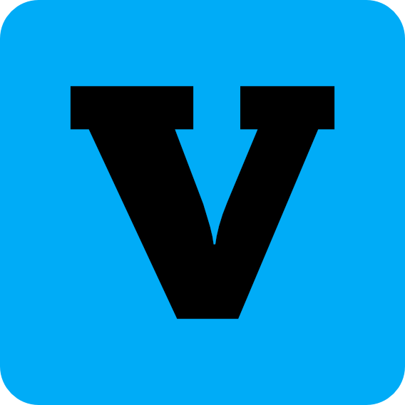

# Creative Suite (Working Title)

> The project name is temporary; a permanent name will be chosen later.

An open-source desktop suite for video editing, raster image editing, and motion
design. The project prioritizes responsive local workflows and targets Windows,
macOS, and Linux.

**Jump to:** [Applications](#applications) | [Build](#build-from-source) |
[Tests](#regression-tests) | [Documentation](#documentation-and-contribution) |
[License](#license)

## Applications

| Icon | Application | Status | Purpose |
| --- | --- | --- | --- |
|  | [Video Editor](docs/video-editor/ROADMAP.md) | Beta 0.1.5 | Multitrack video and audio editing, compositing, and export. |
|  | [Image Editor](docs/image-editor/ROADMAP.md) | Beta 0.1.3 | Layered raster editing, masks, and linked image layers with `.cimg` documents and PNG/JPEG export. |
|  | [Motion Studio](docs/motion-editor/ROADMAP.md) | Beta 0.1.1; validation in progress | Motion design, animation, and advanced compositing. |

The icons above are temporary product assets. Each application loads its PNG
icon from bundled resources for the runtime window. Windows executable icons
are generated separately as multi-resolution `.ico` files, including for
Motion Studio.

The three tracks may be developed in parallel. Video Editor stability remains a
priority. Cross-application work depends on validated interfaces and regression
coverage in both the producer and consumer applications.

### Current work

- **Video Editor:** the desktop shell, multitrack timeline, FFmpeg playback,
  audio mixing, transforms, keyframes, transitions, text overlays, and `.csp`
  project persistence are implemented. Experimental GPU timeline composition is
  available in Settings > General, disabled by default with automatic direct
  texture delivery when supported and RGBA/CPU fallbacks;
  export defaults to CPU with independent experimental GPU composition per queue
  item, including 4K UHD. See the [Video Editor roadmap](docs/video-editor/ROADMAP.md).
- **Image Editor:** Windows users have confirmed the current Release workflow,
  including layers and groups, editable shapes, object selection, save/reopen,
  and export. Imported images support movement, scaling, free rotation, and fixed
  masks with `.cimg` v11, preserving v1–v10 reads. Windows packaging and linked-image acceptance remain in progress;
  macOS and Linux validation is deferred. See the [Image Editor roadmap](docs/image-editor/ROADMAP.md).
- **Motion Studio:** its standalone Qt workspace has a Media Pool, image/video
  timeline layers, native text/rectangle/ellipse layers, CPU preview, playback,
  transform keyframe editing with a Bezier Graph Editor, ordered per-layer
  Gaussian Blur and Color Adjustment effects, and bounded Undo/Redo.
  Manual Save/Open and configurable autosave/recovery use its own versioned
  `.motion` v4 format and a separate recovery wrapper. Its first video export
  offers FFmpeg container,
  encoder, resolution, frame-rate, and quality settings, with progress and
  cancellation. Export is opaque and contains no audio; advanced effects,
  alpha export, and platform validation remain open. C++ and Qt 6 remain
  provisional choices.
  It links shared libraries and builds without the Video or Image Editor
  targets. See the
  [scope and readiness guide](docs/motion-editor/SCOPE_AND_READINESS.md),
  [reuse plan](docs/motion-editor/REUSE_PLAN.md),
  [native format specification](docs/motion-editor/FORMAT.md), and
  [Motion Studio roadmap](docs/motion-editor/ROADMAP.md).

## Project principles

- Native desktop applications with local-first workflows.
- Shared libraries only where multiple applications have a stable, validated
  use for the same capability.
- Cross-platform support, efficient media handling, structured logs, and
  automated regression coverage.

---

## Build from Source

### Requirements

- **CMake** (version 3.24 or newer)
- **C++20 compliant compiler** (MSVC 2022 on Windows, GCC 11+ on Linux, or Clang 14+ on macOS)
- **Qt 6** (Widgets required; Multimedia optional for audio sink)
- **FFmpeg** (libraries: `avformat`, `avcodec`, `avutil`, `swscale`, `swresample`)
- **vcpkg** (recommended for automatic dependency management)

### Configure and build

1. **Clone the repository:**
   ```bash
   # Replace the placeholders with the clone URL and folder shown by the repository host.
   git clone <repository-url>
   cd <repository-folder>
   ```

2. **Configure with CMake and vcpkg:**
   ```bash
   cmake -S . -B build -DCMAKE_TOOLCHAIN_FILE=/path/to/vcpkg/scripts/buildsystems/vcpkg.cmake
   ```
   Replace `/path/to/vcpkg` with the location of your vcpkg checkout. On
   Windows, use forward slashes in the path, for example `C:/dev/vcpkg`.

3. **Build the application you want:**
   ```bash
   # Video Editor
   cmake --build build --config Release --target creative-suite-main-editor

   # Image Editor
   cmake --build build --config Release --target creative-suite-image-editor

   # Motion Studio
   cmake --build build --config Release --target creative-suite-motion-editor
   ```

   To configure Motion Studio as the only application target:
   ```bash
   cmake -S . -B build-motion -DBUILD_VIDEO_EDITOR=OFF -DBUILD_IMAGE_EDITOR=OFF -DBUILD_MOTION_EDITOR=ON
   cmake --build build-motion --config Release --target creative-suite-motion-editor
   ```

4. **Run the Video Editor:**
   ```bash
   # On Windows:
   .\build\apps\video-editor\Release\creative-suite-video-editor.exe

   # On Linux:
   ./build/apps/video-editor/creative-suite-video-editor

   # On macOS:
   open build/apps/video-editor/creative-suite-video-editor.app
   ```

5. **Run the Image Editor:**
   ```powershell
   # On Windows:
   .\build\apps\image-editor\Release\creative-suite-image-editor.exe
   ```
   ```bash
   # On Linux:
   ./build/apps/image-editor/creative-suite-image-editor

   # On macOS:
   open build/apps/image-editor/creative-suite-image-editor.app
   ```

6. **Run Motion Studio:**
   ```powershell
   # On Windows:
   .\build\apps\motion-editor\Release\creative-suite-motion-editor.exe
   ```
   ```bash
   # On Linux:
   ./build/apps/motion-editor/creative-suite-motion-editor

   # On macOS:
   open build/apps/motion-editor/creative-suite-motion-editor.app
   ```

---

## Regression Tests

The project enforces automated regression test coverage for all application logic and module boundaries.

On Windows (PowerShell):
```powershell
.\scripts\run-regression-tests.ps1 -Configuration Release
```

Or directly via CTest:
```bash
ctest --test-dir build -C Release --output-on-failure
```

For testing practices, refer to [`docs/video-editor/REGRESSION_TESTING.md`](docs/video-editor/REGRESSION_TESTING.md).

---

## Keyboard Shortcuts

A complete and continuously updated directory of all user-facing shortcuts is maintained in [`docs/video-editor/SHORTCUTS.md`](docs/video-editor/SHORTCUTS.md).

Common shortcuts in the Video Editor:
| Action | Shortcut |
| :--- | :--- |
| **Play / Pause** | `Space` |
| **Previous Frame / Next Frame** | `Left` / `Right` |
| **Jump to Start / End** | `Home` / `End` |
| **Split Clip at Playhead** | `Ctrl + K` |
| **Blade Tool (Toggle)** | `B` |
| **Selection Tool** | `V` |
| **Delete Selected Clip** | `Delete` |
| **Nudge Clip 1 Frame** | `Ctrl + Left` / `Ctrl + Right` |
| **Move Clip (Between Tracks / Timeline)** | `Alt + Drag` |
| **Undo / Redo** | `Ctrl + Z` / `Ctrl + Y` |
| **Save Project** | `Ctrl + S` |

---

## Documentation and Contribution

Before contributing, please read the project guidelines outlined in [`AGENTS.md`](AGENTS.md). Project and contributor documentation normally uses English. The suite distribution proposal linked below is a Portuguese planning note requested by the maintainer.

| Guide | What it covers |
| --- | --- |
| [Video Editor architecture](docs/video-editor/ARCHITECTURE.md) | Video Editor structure and modules. |
| [Video Editor subsystem docs](docs/video-editor/architecture/) | Technical boundaries and subsystem behavior. |
| [Video Editor roadmap](docs/video-editor/ROADMAP.md) | Current work and release gates. |
| [Video Editor GPU plan](docs/video-editor/GPU_ACCELERATION_PLAN.md) | First consumer of the shared compositor: optional timeline composition, direct texture delivery and per-job GPU export through 4K implemented; broader platform acceptance pending. |
| [Video Editor GPU export](docs/video-editor/GPU_EXPORT.md) | Per-job selection, resource ownership, CPU fallback and independent export metrics. |
| [GPU export results](docs/video-editor/GPU_EXPORT_RESULTS.md) | Native parity, builds/tests, repeated CPU/GPU measurements and remaining platform checks. |
| [Direct GPU preview delivery](docs/video-editor/GPU_TEXTURE_DELIVERY.md) | Shared contexts, texture leases, bounded buffers, fences, asynchronous recovery and diagnostics. |
| [Regression prevention policy](docs/REGRESSION_POLICY.md) | Required test coverage and gates for all current and future applications. |
| [Video Editor regression tests](docs/video-editor/REGRESSION_TESTING.md) | Detailed automated coverage and local validation checklist. |
| [Image Editor scope](docs/image-editor/SCOPE.md) | Approved first editing-release workflow, current boundary, and validation profile. |
| [Image Editor roadmap](docs/image-editor/ROADMAP.md) | Image Editor milestones and validation. |
| [Image Editor GPU plan](docs/image-editor/GPU_ACCELERATION_PLAN.md) | Planned transparent layer/mask composition, interactive editing, export/publication, and acceptance stages; implementation deferred. |
| [Motion Studio scope and readiness](docs/motion-editor/SCOPE_AND_READINESS.md) | Initial users, MVP boundary, capability ownership, and compatibility policy. |
| [Motion Studio reuse plan](docs/motion-editor/REUSE_PLAN.md) | Shared library boundaries and application ownership. |
| [Motion Studio native format](docs/motion-editor/FORMAT.md) | Provisional `.motion` version 4 JSON layout, v1-v3 migration, curve and effect data, and save/open behavior. |
| [Motion Studio roadmap](docs/motion-editor/ROADMAP.md) | Provisional scope and technical milestones. |
| [Motion Studio GPU plan](docs/motion-editor/GPU_ACCELERATION_PLAN.md) | Planned stages for shared GPU composition, effects, and preview/export integration; implementation deferred. |
| [Cross-application compatibility](docs/CROSS_APPLICATION_COMPATIBILITY.md) | Shared interfaces and handoff contracts. |
| [Product and distribution architecture (Portuguese planning document)](docs/PRODUCT_DISTRIBUTION.md) | Provisional boundaries for the future Hub, its integrated recovery feature and standalone recovery tool, and GitHub releases. |
| [Technical prototype comparison](docs/video-editor/TECHNICAL_PROTOTYPE_COMPARISON.md) | Language and technology evaluation. |

## License

This project is licensed under the **GNU General Public License v3.0 or later (GPL-3.0-or-later)**. See the [`LICENSE`](LICENSE) file for the full license text.

Third-party dependencies and libraries:
- **Qt 6**: Licensed under LGPLv3 / GPLv3.
- **Qt Image Formats**: Provides the TIFF and WebP plugins; review the Qt and bundled codec notices before distribution.
- **FFmpeg**: Licensed under LGPLv2.1+ / GPLv2+ depending on the enabled codecs and configuration.
