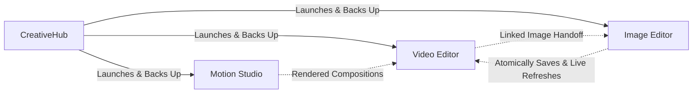

# CreativeHub

An open-source, lightweight, cross-platform creative ecosystem for **video editing**, **raster image design**, **motion graphics compositing**, and **centralized project management**. Built with native C++20, Qt 6, and hardware-accelerated rendering pipelines, CreativeHub targets **Windows**, **macOS**, and **Linux**.

**Jump to:** [The Vision & Proposal](#the-vision--core-proposal) | [Applications](#applications-overview) | [Interoperability & Workflows](#interoperability--connected-workflows) | [Core Principles](#core-engineering-principles) | [Build from Source](#build-from-source) | [Regression Tests](#regression-tests) | [Documentation](#documentation-directory) | [License](#license)

---

## The Vision & Core Proposal

Creative tools are essential to modern storytelling, communication, and digital art. However, today's dominant proprietary creative suites (such as Adobe Creative Cloud) increasingly burden creators with:

- **Aggressive Subscription Walls:** Expensive recurring licenses that lock access to your own work if a payment lapses.
- **Resource Bloat & Sluggish Runtimes:** Heavy background telemetry daemons, constant DRM checks, and memory-hungry web-wrapper shells (Electron) that consume gigabytes of RAM before any project even loads.
- **Cloud Lock-in & Privacy Loss:** Forced cloud synchronization, mandatory user accounts, and telemetry tracking creative files and usage patterns.
- **Brittle Ecosystem Coupling:** Monolithic installations where updating one component risks corrupting project environments or breaking dependencies.

### What This Project Offers

This project delivers a **professional, modern, 100% free and open-source alternative** designed around four foundational pillars:

1. **Freedom & Transparency (GPL-3.0-or-later):** A completely open-source suite with no subscriptions, no paywalled features, and no vendor lock-in.
2. **Local-First & Absolute Privacy:** Operates entirely offline on your workstation. Zero required accounts, zero mandatory cloud synchronization, and zero telemetry on your creative media or project assets. Your files stay strictly yours.
3. **Pure Native Performance:** Engineered in modern **C++20** and **Qt 6** with direct GPU hardware acceleration (OpenGL). Fast startup times, lean memory footprints, and fluid timeline responsiveness—even on modest laptop hardware.
4. **Modular Yet Interoperable Ecosystem:** Independent, focused applications that excel at their specific tasks, connected by non-destructive asset linking, versioned open project formats, and a shared high-performance core library.

---

## Applications Overview

The suite is composed of four coordinated desktop applications:

| Icon | Application | ID | Status | Primary Purpose |
| :---: | :--- | :---: | :---: | :--- |
|  | **CreativeHub** | `hub` | Beta 0.1.0 | Suite command center: project launching, recent files, project backup vault, storage cache cleanup, and isolated per-app updates. |
|  | [**Video Editor**](docs/video-editor/ROADMAP.md) | `video-editor` | Beta 0.1.0 | Multitrack audiovisual editing (NLE), trimming, GPU-accelerated compositing, audio mixing, text overlays, and FFmpeg export. |
|  | [**Image Editor**](docs/image-editor/ROADMAP.md) | `image-editor` | Beta 0.1.0 | Layered raster editing, vector shapes, layer masks, and atomic linked-image handoff with the Video Editor. |
|  | [**Motion Studio**](docs/motion-editor/ROADMAP.md) | `motion-editor` | Beta 0.1.0 | Motion graphics, Bezier Graph Editor curve animation, layer compositing, Gaussian blur/color effects, and video export. |

> *Note:* App icons are temporary product assets. Executable icons on Windows are generated as multi-resolution `.ico` binaries.

---

### Deep Dive into the Suite Components

#### 1. CreativeHub (`hub`)
The central desktop management console and launcher for the entire creative ecosystem:
- **App Launcher & Discovery:** Scans the workstation for installed suite applications, verifies operational health, and launches editors with appropriate launch profiles.
- **Unified Recent Projects:** Aggregates recent documents across all editors (`.csp`, `.cimg`, `.motion`), with thumbnail previews, app badges, and direct project opening.
- **Resilient Per-App Updates:** Inspects release catalogs, validates cryptographic signatures and SHA-256 integrity, schedules background updates per application, and provides automated rollback protection if an installation or launch fails.
- **Project Backup Vault:** Automatically or manually captures timestamped project snapshots to prevent accidental data loss.
- **Safe Storage Manager:** Analyzes disk space used by temporary render files and media caches across the suite, providing one-click safe cleanup without touching user project files.
- See the [Hub regression documentation](docs/hub/REGRESSION_TESTING.md) and [product distribution architecture](docs/PRODUCT_DISTRIBUTION.md).

#### 2. Video Editor (`video-editor`)
A full-featured multitrack non-linear audiovisual editor (NLE) tailored for storytelling and rapid assembly:
- **Multitrack Timeline:** Non-linear audio and video tracks, razor/blade tools, ripple edits, clip nudging, and snapping.
- **FFmpeg Decoding & Playback:** High-performance video decoding supporting standard broadcast and web codecs.
- **Hardware-Accelerated Compositing:** Experimental GPU timeline rendering (Settings > General) with direct texture delivery and fallback to robust CPU composition.
- **Transformations & Keyframing:** Spatial keyframing for position, scale, rotation, and opacity transitions.
- **Audio Mixing:** Multi-channel playback, volume envelopes, and track level controls.
- **4K UHD Export Engine:** Configurable FFmpeg container and encoder pipelines with independent per-job CPU or GPU compositing.
- See the [Video Editor roadmap](docs/video-editor/ROADMAP.md) and [architecture guide](docs/video-editor/ARCHITECTURE.md).

#### 3. Image Editor (`image-editor`)
A responsive raster canvas optimized for asset creation, photo manipulation, and graphics design:
- **Layer & Group Management:** Multi-layer hierarchy with group nesting, visibility toggling, and opacity blending.
- **Raster Masks & Straight Alpha:** Non-destructive layer masks (`.cimg` format) preserving transparent cutouts.
- **Vector Shapes & Drawing:** Vector rectangles, ellipses, text layers, and freehand drawing tools.
- **Transformations & Selections:** Bounding-box selection, scaling, translation, and free rotation.
- **Linked Asset Companion Workflow:** Directly open and edit image clips referenced by the Video Editor; saving atomically updates the video timeline without destructive raster flattening.
- See the [Image Editor roadmap](docs/image-editor/ROADMAP.md) and [scope specification](docs/image-editor/SCOPE.md).

#### 4. Motion Studio (`motion-editor`)
A dedicated motion design and 2D animation workstation for complex visual compositions:
- **Media Pool & Composition Timeline:** Dedicated media library, nested composition timelines, and multi-layer staging.
- **Bezier Graph Editor:** Precise curve manipulation for smooth velocity, easing, and spatial animation trajectories.
- **Native Shape & Text Engine:** Animatable vector paths, geometric primitives, and typography layers.
- **Layered Effects Pipeline:** Chained per-layer visual filters, including real-time Gaussian Blur and Color Adjustments.
- **Video Export:** High-quality offline video rendering via FFmpeg with custom resolution, framerate, and codec presets.
- See the [Motion Studio roadmap](docs/motion-editor/ROADMAP.md) and [scope & readiness guide](docs/motion-editor/SCOPE_AND_READINESS.md).

---

## Interoperability & Connected Workflows

Unlike fragmented toolsets where moving assets between applications requires manual export, rasterization, and re-import, the suite features **non-destructive interoperability**:



1. **Linked Image Editing:** Right-clicking an image clip in the Video Editor opens it directly in the Image Editor. The source asset remains intact, while a companion `.cimg` document tracks the layered edits. When saved, the Video Editor immediately invalidates its frame cache and live-refreshes the clip in the timeline.
2. **Open, Versioned Project Formats:**
   - `.csp` (Video Editor Project)
   - `.cimg` (Image Editor Document)
   - `.motion` (Motion Studio Composition)
   All formats are strictly versioned, human-readable, and backward-compatible to guarantee your creative archives can be opened years from now.
3. **Resilient Data Protection:** Automatic autosave snapshots and separate recovery wrappers ensure that system crashes or power interruptions never corrupt master project files.

---

## Core Engineering Principles

- **Shared Core Libraries (`libs/`):** Code reuse is achieved via modular CMake static libraries (`media-frame`, `video-media`, `video-encoding`, `media-assets`, `animation`, `composition`, `diagnostics`, `updater`, `system-monitor`, `shortcuts`). No monolithic entanglement or bloated shared runtimes.
- **Cross-Platform by Design:** Built from day one for Windows, macOS, and Linux without platform lock-in. Platform-specific APIs are isolated behind clean adapter layers.
- **Predictable, Isolated Updates:** Each application can update independently. Updates preserve user preferences, project documents, and recovery snapshots. If an update fails, automated rollback restores the prior working installation.
- **Strict Automated Regression Policy:** Every user-facing capability, bug fix, and module boundary requires automated regression test coverage before being accepted into the codebase.

---

## Build from Source

### Prerequisites

- **CMake** (version 3.24 or newer)
- **C++20 compliant compiler** (MSVC 2022 on Windows, GCC 11+ on Linux, or Clang 14+ on macOS)
- **Qt 6** (Qt6 Core, Widgets, OpenGL, OpenGLWidgets; Multimedia optional for audio sink)
- **FFmpeg** (libraries: `avformat`, `avcodec`, `avutil`, `swscale`, `swresample`)
- **vcpkg** (recommended for cross-platform dependency management)

### 1. Clone the Repository

```bash
git clone https://github.com/BadTonho/AdobeShoppee.git
cd AdobeShoppee
```

### 2. Configure with CMake

Using vcpkg toolchain integration:

```bash
cmake -S . -B build -DCMAKE_TOOLCHAIN_FILE=/path/to/vcpkg/scripts/buildsystems/vcpkg.cmake
```

*(On Windows, use forward slashes for the toolchain path, e.g., `C:/dev/vcpkg/scripts/buildsystems/vcpkg.cmake`)*

### 3. Build Applications

You can build the entire suite or individual applications:

```bash
# Build CreativeHub
cmake --build build --config Release --target creative-suite-hub

# Build the Video Editor
cmake --build build --config Release --target creative-suite-main-editor

# Build the Image Editor
cmake --build build --config Release --target creative-suite-image-editor

# Build Motion Studio
cmake --build build --config Release --target creative-suite-motion-editor
```

To configure and build only a single application (e.g., Motion Studio):
```bash
cmake -S . -B build-motion -DBUILD_VIDEO_EDITOR=OFF -DBUILD_IMAGE_EDITOR=OFF -DBUILD_CREATIVE_HUB=OFF -DBUILD_MOTION_EDITOR=ON
cmake --build build-motion --config Release --target creative-suite-motion-editor
```

### 4. Run the Applications

Executable outputs are generated under `build/apps/<application-id>/`:

| Application | Windows | Linux | macOS |
| :--- | :--- | :--- | :--- |
| **CreativeHub** | `.\build\apps\hub\Release\creative-suite-hub.exe` | `./build/apps/hub/creative-suite-hub` | `open build/apps/hub/creative-suite-hub.app` |
| **Video Editor** | `.\build\apps\video-editor\Release\creative-suite-video-editor.exe` | `./build/apps/video-editor/creative-suite-video-editor` | `open build/apps/video-editor/creative-suite-video-editor.app` |
| **Image Editor** | `.\build\apps\image-editor\Release\creative-suite-image-editor.exe` | `./build/apps/image-editor/creative-suite-image-editor` | `open build/apps/image-editor/creative-suite-image-editor.app` |
| **Motion Studio** | `.\build\apps\motion-editor\Release\creative-suite-motion-editor.exe` | `./build/apps/motion-editor/creative-suite-motion-editor` | `open build/apps/motion-editor/creative-suite-motion-editor.app` |

---

## Regression Tests

The project enforces automated test coverage for all application logic, shared libraries, and module boundaries.

**On Windows (PowerShell):**
```powershell
.\scripts\run-regression-tests.ps1 -Configuration Release
```

**Via CTest (Cross-Platform):**
```bash
ctest --test-dir build -C Release --output-on-failure
```
---

## Documentation Directory

Before contributing, please read the repository guidelines in [`AGENTS.md`](AGENTS.md).

| Category | Guide | Description |
| :--- | :--- | :--- |
| **Architecture** | [Video Editor Architecture](docs/video-editor/ARCHITECTURE.md) | Video Editor modules and subsystem architecture. |
| | [Cross-Application Compatibility](docs/CROSS_APPLICATION_COMPATIBILITY.md) | Shared contracts, linked-document handoffs, and extraction criteria. |
| | [Product & Distribution Architecture](docs/PRODUCT_DISTRIBUTION.md) | CreativeHub architecture, app recovery, and release strategies *(Portuguese planning doc)*. |
| | [Windows Update Contract](docs/WINDOWS_UPDATES.md) | Update catalog format, verification, staging, and rollback mechanics. |
| **Video Editor** | [Video Editor Roadmap](docs/video-editor/ROADMAP.md) | Milestones, stabilization, and release criteria. |
| | [Keyboard Shortcuts](docs/video-editor/SHORTCUTS.md) | User-facing keyboard shortcut directory. |
| | [GPU Acceleration Plan](docs/video-editor/GPU_ACCELERATION_PLAN.md) | OpenGL composition pipeline, textures, and export integration. |
| | [GPU Export Pipeline](docs/video-editor/GPU_EXPORT.md) | Resource management and independent export metrics. |
| | [Direct GPU Preview Delivery](docs/video-editor/GPU_TEXTURE_DELIVERY.md) | Shared contexts, texture leases, fences, and diagnostics. |
| **Image Editor** | [Image Editor Scope](docs/image-editor/SCOPE.md) | Layer workflow, selection tools, and acceptance criteria. |
| | [Image Editor Roadmap](docs/image-editor/ROADMAP.md) | Development roadmap and platform validation milestones. |
| **Motion Studio** | [Motion Studio Scope & Readiness](docs/motion-editor/SCOPE_AND_READINESS.md) | Standalone MVP boundary, capability ownership, and format migration. |
| | [Motion Studio Native Format](docs/motion-editor/FORMAT.md) | `.motion` JSON schema, curve evaluation, and effect data. |
| | [Motion Studio Reuse Plan](docs/motion-editor/REUSE_PLAN.md) | Reusable library boundaries vs application-owned components. |
| | [Motion Studio Roadmap](docs/motion-editor/ROADMAP.md) | Technical milestones and export evolution. |
| **Quality & Tests** | [Regression Prevention Policy](docs/REGRESSION_POLICY.md) | Universal test coverage mandates for all suite components. |
| | [Video Editor Regression Tests](docs/video-editor/REGRESSION_TESTING.md) | Verification index and manual testing checklists. |
| | [CreativeHub Regression Tests](docs/hub/REGRESSION_TESTING.md) | CreativeHub verification index, catalog tests, and update flows. |

---

## License

This project is licensed under the **GNU General Public License v3.0 or later (GPL-3.0-or-later)**. See the [`LICENSE`](LICENSE) file for the full license text.

Third-party dependencies and libraries:
- **Qt 6**: Licensed under LGPLv3 / GPLv3.
- **Qt Image Formats**: TIFF and WebP plugins (review Qt and bundled codec notices before distribution).
- **FFmpeg**: Licensed under LGPLv2.1+ / GPLv2+ depending on enabled codecs and build configurations.

